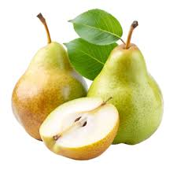

# 1.Headings

How to write heading in markdown?

# Heading 1
## Heading 2
### Heading 3
#### Heading 4
##### Heading 5
###### Heading 6
###### so on.

# 2.Block of words
How to write block of words in markdown?

This is a normal text of markdown. We can write as many lines as we want. It will be treated as a single block of words.

>This is a special text of markdown.

>This is a second line of special text of markdown.

or if we want special text in text  with 2 lines then we can write like this:
>This is a special text of markdown. 
>
>This is a second line of special text of markdown.
# 3.Line Breaks
How to write line breaks in markdown? BY using two spaces at the end of the line. OR by using backslash at the end of the line. LIKE THIS:\

it is simple book of mathematics.

no its not a simple book of mathematics.

OR

it is simple book of mathematics.\
no its not a simple book of mathematics.\
# 4.Combine two things 
Block of special words and Headings can be combined together. Like this:
># Heading 2
# 5. Face of Text
How to write face of text in markdown? By using asterisk or underscore. Like this:
# **Bold**
# *Italic*
# ***Bold and Italic***
or you can use these symbols in combination with each other. Like this:

_(Underscore)

_**Bold and Underscore**

__Bold__

_Italic_

#write in coments about Bold and Italic

# 6. Lists (Bulleted and Numbered):
How to write lists in markdown? By using asterisk, plus, or hyphen for bulleted lists and numbers followed by a period for numbered lists. Like this:
# Bulleted List:
  - used for bullets if i want write bullets in bullets ican "space TAB" after dash  or if I want to goback simple "shift TAB" after dash.
- Ali
- Ahmed
- Ayesha
- Numbered List:
  -  First item
     -   1.1 sub item
     -   
     -   
 -    1.2 sub item
      -     ali
-     
-     ahmed
-     

-  
-  Second item
# 7.Numberring of Lists:

1. First item
2. second item
3. third item
4. fourth item
5. fifth item
6.  sixth item 
      1. item a
      2. item b
> using __**using*or +__ 
> - for bulleted list

*one space missing

* one
* two
* three
  * four
+ one
  
  + two
+  
  
+ two
+  three
  + four
 + five a
    
## 8. Line breaks or page breaks
How to write line breaks or page breaks in markdown? By using three hyphens or asterisks. Like this:
---
or
***
This is a page 1.

_ _ _This is a page 2.

---This is a page 3. no

__This is a page 4. yes__
---
1st page
---
2nd page
---
3rd page
---
4rth page
***
5th page
---
___
***
***
# 9. Links and Hyperlinks
How to write links and hyperlinks in markdown? By using square brackets for the text and parentheses for the URL. Like this:
[Link](https://www.example.com
or
[Google](https://www.google.com)
or
[Play list of python ka chilla](https://www.youtube.com/playlist?list=PLu0W_9lII9agICnT8t4iYVSZ3eykIAI)

[Codanics]:https://www.youtube.com/channel/UC9r3qWw2Y5k1C8nFZsVJYQ

The whole course is [here][Codanics].

# 10. Images and Figures with link
How to write images and figures in markdown? By using an exclamation mark followed by square brackets for the alt text and parentheses for the image URL. Like this:
To read the wikipedia please click on the image below:

)

)

__If you want an image you need to drag to desktop and then paste the png file link to get the image.__ 

)

> HOW to comment out mark down line 
> and its short cut.  **assignment for you**

# 11. Adding code  OR CODE 
blocks

   

   
   

